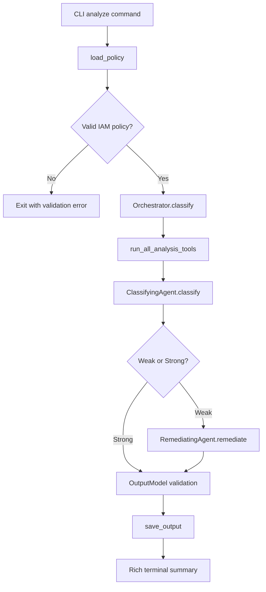
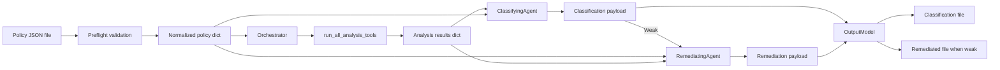
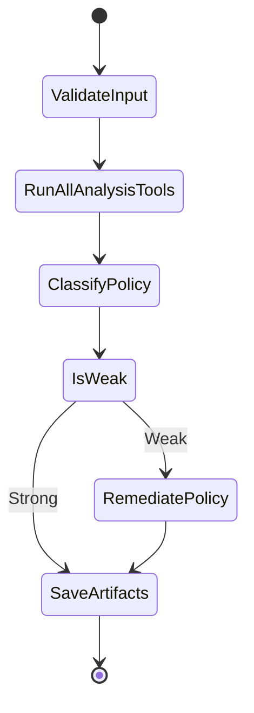

# AWS IAM Policy Classifier and Remediator Documentation

## 1. Purpose and Scope

This document explains how the project classifies AWS IAM policies, why the agentic architecture is decomposed the way it is, and how data moves from the CLI input to the saved JSON outputs. It complements the shorter project README by documenting the decision rules, architectural tradeoffs, and internal component boundaries in more detail.

This implementation has two hard phases:

1. Preflight validation. The input must be valid JSON and must conform to the supported IAM policy schema.
2. Agentic analysis and optional remediation. All deterministic analysis tools run first; their combined output is then passed to a Gemini-backed agent that classifies the policy in a single prompt, and invokes a separate remediation prompt only when the policy is weak.

Invalid inputs are rejected before classification. They are neither Strong nor Weak.

## 2. Classification Definition: What Makes a Policy Weak or Strong

### 2.1 Classification Preconditions

Before a policy can be ranked, it must pass these preconditions:

- The file must contain valid JSON.
- The top-level payload must be either the policy itself or an object with a `policy` key.
- The policy must match the supported IAM schema enforced by `PolicyModel` and `StatementModel`.
- Unsupported attributes are rejected instead of being silently ignored.

If any precondition fails, the CLI exits with an input-validation error and the agent loop is never started.

### 2.2 Binary Classification Rule

The runtime classification is binary:

- `Strong`: The policy passes preflight validation and the agent finds no material least-privilege weakness.
- `Weak`: The policy passes preflight validation and at least one material weakness is found.

In practice, a policy is classified as `Weak` when any analysis tool returns a finding that indicates materially excessive access, unsafe inversion logic, or missing compensating controls on a permissive Allow statement.

### 2.3 Finding Severity and Ranking Criteria

The implementation also assigns severities to findings so the model can explain the result and prioritize remediation.

| Severity | Meaning | Classification impact |
| --- | --- | --- |
| `CRITICAL` | Administrator-equivalent, nearly unbounded, or inversion-based access with a high chance of privilege escalation. | Always contributes to `Weak`. |
| `HIGH` | Material least-privilege failure that meaningfully widens the blast radius of an Allow statement. | Always contributes to `Weak`. |
| `LOW` | Broadness is present, but the statement also carries compensating structure that keeps the current implementation from treating it as materially weak by itself. | Does not force `Weak` on its own. |

The overall narrative ranking of a policy is the maximum severity found. The binary verdict remains `Strong` or `Weak`, but the severities explain how serious the detected weaknesses are.

### 2.4 Explicit Test Criteria Used by the System

The following rules define the current evaluation criteria.

| Criterion | Implemented by | Trigger | Severity | Weak/Strong effect |
| --- | --- | --- | --- | --- |
| Administrator-equivalent access | `check_effect_allow_star` | `Effect: Allow` with both `Action: "*"` and `Resource: "*"` in the same statement | `CRITICAL` | Always `Weak` |
| Wildcard action access | `check_wildcards` | An Allow statement uses `*`, `service:*`, or another wildcard action pattern | `CRITICAL` for `*`, otherwise `HIGH` | Always `Weak` |
| Broad resource scope without adequate compensation | `check_resource_scope` | An Allow statement targets `Resource: "*"` or a structurally broad ARN pattern | Usually `HIGH` | `Weak` when materially broad |
| Missing conditions on permissive access | `check_conditions` | A broad Allow statement or privileged `iam:` / `sts:` write path lacks `Condition` | `CRITICAL` when `Action: "*"`, otherwise `HIGH` | Always `Weak` |
| Inverted allow logic | `check_not_actions` | An Allow statement uses `NotAction` | `CRITICAL` | Always `Weak` |

### 2.5 Important Nuances in the Current Rules

The current code intentionally makes a few non-obvious distinctions:

- Not every ARN wildcard is weak. Resource patterns such as `arn:aws:s3:::bucket/*` or anchored log-stream suffixes can still be scoped enough to remain strong.
- A broad `Resource` can be recorded as `LOW` severity when the statement is otherwise constrained by a `Condition` and does not also use broad actions. This behavior is explicitly covered by tests.
- The tools focus on risky `Allow` statements. `Deny` statements are not treated as weaknesses simply for being broad.
- The classifier is intentionally conservative about `NotAction` because it inverts access logic and is easy to misuse.
- The remediation phase is only triggered after a `Weak` decision. Strong policies are not rewritten.

### 2.6 How to Test the Criteria

The repository includes fixtures and tests that anchor these rules. Among them:

- `tests/sample_policies/weak1.json`: full-admin style wildcard access, expected `Weak`.
- `tests/sample_policies/weak4.json`: `NotAction` trap, expected `Weak`.
- `tests/sample_policies/weak6.json`: permissive statement without conditions, expected `Weak`.
- `tests/sample_policies/strong1.json`: constrained allow-list, expected `Strong`.
- `tests/sample_policies/strong4.json`: broad resource pattern with compensating condition, recorded as `LOW` severity and still treated as strong overall.

These fixtures are exercised in the analysis-tool and orchestrator tests, which verify both the raw tool findings and the end-to-end workflow behavior.

## 3. Agentic Architecture

### 3.1 Technology Stack and Why It Was Chosen

| Technology | Role | Why it was chosen |
| --- | --- | --- |
| Python | Implementation language | Fast iteration, simple CLI ergonomics, strong validation/testing libraries. |
| Typer | CLI framework | Minimal boilerplate, typed options, readable command signatures. |
| Rich | Terminal output | Clear operator-facing summaries and verbose trace output. |
| Pydantic v2 | Schema validation | Strict shape enforcement for IAM input and output payloads. |
| `python-dotenv` | Environment loading | Keeps API configuration simple and local-development friendly. |
| `google-genai` | Gemini SDK | Official client for structured JSON generation and model invocation. |
| Gemini Flash Light Latest | Classification and remediation model | Lightweight, low-latency model well-suited to the small context windows required by policy classification and remediation, at lower cost than heavier frontier models. |
| Pytest | Regression testing | Lightweight, standard Python testing with good fixture support. |

#### Gemini Flash Light Latest Justification

The default model is `gemini-flash-light-latest`.

- Cost: this project makes at least one model call for classification and a second call for remediation when the policy is weak. The light-tier model keeps those repeated calls materially cheaper than a larger or reasoning-class model.
- Performance: each call is a single structured prompt with compact tool output; there is no long iterative loop. The light model provides low latency and adequate throughput for this workload.
- Capability: the context window required by policy classification and remediation is small. The inputs are a single IAM policy and the concise outputs of five deterministic tools. The light model comfortably handles this without needing a larger context budget.
- Operational simplicity: the same model is used for both classification and remediation, keeping configuration uniform.

Model temperatures are intentionally separated:

- Classification: `0.1` to keep tool selection and verdict formatting stable.
- Remediation: `0.3` to allow controlled flexibility when rewriting policies.

### 3.2 Component Inventory

This implementation uses one top-level agent, no sub-agents, and no separate skills layer.

| Component | Type | Inputs | Outputs | Responsibility |
| --- | --- | --- | --- | --- |
| `main.py` / `analyze` | CLI entry point | File path, output directory, verbose flag | Process exit code, terminal summary, saved JSON files | Accepts operator input and starts orchestration. |
| `Orchestrator` | Control-plane coordinator | Validated policy object | `OutputModel` | Runs all analysis tools, passes their combined output to the classifying agent, and conditionally invokes the remediating agent. |
| `ClassifyingAgent` | LLM agent | Policy JSON and analysis results | Classification payload | Sends a single structured prompt to Gemini and returns the `Weak`/`Strong` verdict with a reason. |
| `RemediatingAgent` | LLM agent | Policy JSON and analysis results | Remediation payload | Sends a single structured prompt to Gemini and returns a tightened policy, change list, and reasoning. Only invoked after a `Weak` verdict. |
| `agent/prompts.py` helpers | Prompt/protocol layer | Policy JSON and analysis results | Gemini-ready prompt strings and system instructions | Builds the classification and remediation prompts and defines their JSON response schemas. |
| `run_all_analysis_tools` | Tool runner | Policy JSON | Combined analysis results dict | Executes all five deterministic analysis tools and merges their outputs before any LLM call is made. |
| `check_wildcards` | Deterministic analysis tool | Policy JSON | Finding list and recommendation | Detects wildcard actions. |
| `check_resource_scope` | Deterministic analysis tool | Policy JSON | Finding list and recommendation | Detects materially broad resources. |
| `check_conditions` | Deterministic analysis tool | Policy JSON | Finding list and recommendation | Detects missing compensating conditions. |
| `check_not_actions` | Deterministic analysis tool | Policy JSON | Finding list and recommendation | Detects `NotAction` misuse. |
| `check_effect_allow_star` | Deterministic analysis tool | Policy JSON | Finding list and recommendation | Detects full-admin equivalent statements. |
| `PolicyModel` / `StatementModel` | Schema layer | Raw policy JSON | Validated IAM object | Rejects malformed or unsupported inputs. |
| `utils.validators` | Policy semantics helpers | Policy or statement fragments | Normalized values and classification predicates | Encodes reusable least-privilege checks. |
| `utils.gemini` | Gemini adapter | API key, model name, prompt, config | Parsed JSON payloads or typed errors | Isolates SDK setup and response handling. |
| `OutputModel` | Output contract | Final classification fields | Serialization helpers and Rich summary table | Defines what gets saved and displayed. |
| `utils.file_io` | Persistence layer | File paths and payloads | Loaded policies and saved output files | Reads input safely and writes result artifacts. |
| Sub-agents | None | None | None | Not used in the current implementation. |
| Skills | None | None | None | Not used in the current implementation. |

### 3.3 How the Components Interact

#### CLI to Orchestrator

The CLI loads the policy file, validates it through the file I/O helpers, and instantiates the orchestrator. The orchestrator receives a normalized policy object, not raw file contents.

#### Orchestrator to Analysis Tools

The orchestrator calls `run_all_analysis_tools`, which executes all five deterministic tools against the policy and merges their outputs into a single results dictionary. This happens before any LLM call is made.

#### Orchestrator to Classifying Agent

The orchestrator passes the policy and the combined analysis results to `ClassifyingAgent.classify`. The agent builds a single prompt that includes both the policy and the full tool output, sends it to Gemini, and returns a `classification` and `reason`.

#### Orchestrator to Remediating Agent

If the classification is `Weak`, the orchestrator passes the same policy and analysis results to `RemediatingAgent.remediate`. The agent builds a separate remediation prompt, sends it to Gemini in a single call, and returns a rewritten policy, a list of changes, and reasoning. The two agents use independent prompts and system instructions to keep their tasks focused.

#### Agent to Output Model

The orchestrator assembles the classification payload, any remediation payload, and the normalized original policy into an `OutputModel`. That object is the single source for both on-screen display and saved JSON files.

### 3.4 Why This Decomposition Was Chosen

#### Why one top-level agent and no sub-agents

The domain is narrow and the toolset is small. A single agent can comfortably hold the full policy and the complete tool output in one context window. Adding sub-agents would increase latency, token usage, and coordination complexity without buying much specialization benefit.

Rejected alternative: multiple specialist sub-agents such as a wildcard reviewer, a condition reviewer, and a remediation planner.

Reason rejected: the deterministic tools already provide specialization. A multi-agent graph would mostly duplicate that logic while making the trace harder to reason about.

#### Why deterministic checks run before the LLM instead of being called by it

Wildcard detection, broad-resource detection, and missing-condition checks are cheap, testable, and deterministic. Running all of them up front and passing their output directly to the LLM has three advantages:

- They are auditable and unit-testable independently of the LLM.
- They reduce token spend because the model does not need to re-derive obvious predicates from scratch.
- Their outputs are concise enough to fit comfortably in a single prompt, so there is no benefit to an iterative call-and-observe loop.

Rejected alternative: an iterative ReAct loop where the model picks which tool to call next.

Reason rejected: the tool outputs are compact and non-redundant; running all of them once and presenting the combined results in a single prompt is simpler, faster, and produces equally accurate classification decisions.

#### Why classification and remediation use separate prompts

Even though tool outputs are compact, bundling classification and remediation into a single prompt would overload the model with two distinct tasks. Separate prompts and system instructions keep each call focused: the classifier decides `Weak` or `Strong`, and the remediator rewrites the policy only once that verdict is confirmed.

Rejected alternative: a single prompt that classifies and remediates in one pass.

Reason rejected: asking the model to produce both a verdict and a full policy rewrite in one response increases the chance of confusion, requires a larger output budget, and runs remediation unconditionally on every policy regardless of its classification.

#### Why remediation is LLM-backed rather than deterministic code

Remediation requires intent preservation, example ARN generation, and rewriting broad permissions into a narrower but still usable policy. That is not a simple rule substitution problem. It is the one part of the workflow where generative flexibility is useful.

Rejected alternative: a deterministic rules engine that rewrites every weak policy.

Reason rejected: a rules engine can handle only a small fixed set of patterns and struggles to preserve likely user intent across services.

#### Why strict validation exists before and after LLM calls

The system validates the input before orchestration and validates the remediated policy before it is returned. This prevents the LLM from becoming the only source of truth for syntax and shape correctness.

Rejected alternative: trust the model's JSON output directly.

Reason rejected: invalid IAM JSON or unsupported attributes would silently degrade reliability.

## 4. Architecture Diagrams

### 4.1 Control Flow

### 4.2 Data Flow

### 4.3 Workflow Phases

## 5. Summary

This project intentionally mixes deterministic security checks with LLM-based judgment. Deterministic tools handle the parts that should be stable, cheap, and testable. All five tools run up front and their combined output is passed directly to the LLM in a single structured prompt, keeping latency low and the workflow simple. Gemini handles the parts that benefit from contextual reasoning: classifying the policy based on tool evidence, and rewriting weak policies while preserving intent. Classification and remediation use separate prompts and system instructions to keep each call focused. The result is a system that is more explainable than a one-shot prompt and more adaptable than a purely hard-coded remediation engine.